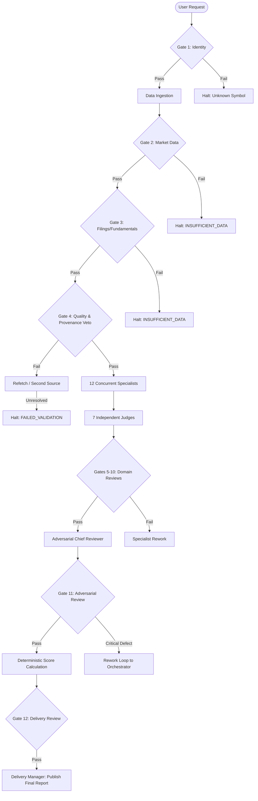

# System Design Specification: Multi-Agent AI Equity Research System (U.S. and Canada)

**Date**: 2026-09-14  
**Status**: Approved / Ready for Implementation  
**Scope**: Production-oriented multi-agent research, quantitative validation, scoring, and report generation platform for U.S. and Canadian equities and ETFs.

---

## 1. Executive Overview & System Goals

The Multi-Agent AI Equity Research System is an institutional-grade research platform built in Python. Given an equity or ETF ticker symbol (e.g., `AAPL`, `MSFT`, `NVDA`, `SHOP.TO`, `RY.TO`), the system executes a disciplined, multi-tiered pipeline:
1. **Security Identity & Classification**: Resolves canonical identity across US (NYSE, Nasdaq, AMEX) and Canadian (TSX, TSXV) markets, strictly isolating currencies (USD vs CAD) and accounting regimes.
2. **Multi-Tiered Data Ingestion & Storage**: Acquires market data (minimum 252 bars for full technical indicators), SEC EDGAR XBRL filings, SEDAR+ continuous disclosures, FRED macroeconomic data, and deduplicated news/sentiment. Raw data is immutably stored in Parquet format partitioned by `[provider, dataset, symbol, date]`.
3. **Strict Data Quality Gate (Hard Veto)**: Enforces freshness, non-negative price/volume, split/dividend reconciliation, and cross-source tolerance verification before any specialist agent runs.
4. **26 Specialist & Reviewer Agents**: 17 analytical specialists (fundamentals, technicals, valuation, risk, sentiment, forensics, macro, management, quant, scenarios), 7 independent domain judges, 1 adversarial Chief Reviewer, and 1 Delivery Manager.
5. **Deterministic Quantitative & Scoring Engine**: Computes local indicators (RSI, MACD, Bollinger, ATR, VWAP), forensic metrics (Piotroski F-Score, Altman Z-Score, Sloan Accruals), valuation models (DCF, reverse DCF, Graham Number), and a mathematically reproducible composite **AI Score** (1.0–10.0 and 0–100 scale) alongside an explicit **Confidence Score** (0.0–1.0) with documented penalties.
6. **Auditable & Human-Readable Delivery**: Outputs 25 partitioned subdirectories per ticker under `research/<SYMBOL>/`, publishing an 18-section research report, an "In Plain English" summary, structured JSON artifacts, and an immutable audit log.

---

## 2. Directory & Package Architecture

The project is structured as a modular Python package `stock_analyzer` with strict separation of concerns:

```text
StockMarketAnalyzer/
├── config/                                  # Project data & screening rules
│   ├── stock_market_data_config.yaml        # Authoritative provider definitions & source priorities
│   ├── stock_market_data_config_v2.yaml     # Extended provider endpoints & parsing rules
│   └── undervalued_stock_screening_rules_v2.yaml # Screening rules & valuation stages
├── stock_analyzer/                          # Core Python package
│   ├── __init__.py
│   ├── __main__.py                          # CLI runner (`python -m stock_analyzer`)
│   ├── core/                                # Foundation layer
│   │   ├── config.py                        # Config parser & source registry
│   │   ├── models.py                        # Pydantic schemas (AgentTask, AgentOutput, GateResult)
│   │   ├── security_master.py               # Canonical security master & US/CA ticker resolver
│   │   ├── provenance.py                    # Lineage tracking & ProvenanceRecord
│   │   └── audit.py                         # JSON audit logger
│   ├── providers/                           # Multi-tiered data adapters
│   │   ├── base.py                          # BaseProvider, rate limiting & retry backoff
│   │   ├── edgar.py                         # Direct SEC EDGAR XBRL API (User-Agent compliant)
│   │   ├── open_market.py                   # OHLCV market data adapter (252+ daily bars)
│   │   ├── fred.py                          # FRED macroeconomic data client
│   │   ├── gdelt.py                         # GDELT news tone & volume client
│   │   ├── sedar.py                         # Canadian disclosure / SEDAR+ mapping
│   │   └── licensed/                        # Polygon, Finnhub, FMP, Twelve Data (when keys exist)
│   ├── engine/                              # Pure quantitative & mathematical calculations
│   │   ├── technical.py                     # SMA, EMA, RSI, MACD, ATR, Bollinger, VWAP, OBV
│   │   ├── fundamental.py                   # Financial statement ratios: ROIC, margins, FCF, ratios
│   │   ├── valuation.py                     # DCF (FCFF), Reverse DCF, Graham Number, peer multiples
│   │   ├── forensics.py                     # Piotroski F-Score, Altman Z-Score, Sloan Accrual Ratio
│   │   └── scoring.py                       # Composite AI Score, extended scores, confidence model
│   ├── agents/                              # 26 Specialist agents, judges & reviewers
│   │   ├── base.py                          # BaseAgent with Gemini Flash 3.8 & offline mock runner
│   │   ├── specialists/                     # 17 analytical specialist agents
│   │   ├── judges/                          # 7 domain judge agents
│   │   ├── chief_reviewer.py                # Adversarial Chief Reviewer agent
│   │   └── delivery_manager.py              # Report generation & publishing agent
│   ├── pipeline/                            # Gated DAG execution engine
│   │   ├── context.py                       # Immutable research run context
│   │   ├── gates.py                         # Gate 1 to Gate 12 quality checkers
│   │   └── orchestrator.py                  # Concurrent runner, state tracking & rework handler
│   └── cli/                                 # Terminal interface
│       └── main.py                          # Rich terminal interface
├── research/                                # Output directory (one per analyzed ticker)
│   └── <SYMBOL>/                            # 25 structured folders (00_identity to 24_audit)
└── tests/                                   # Automated test suite
```

### Research Output Directory Structure (`research/<SYMBOL>/`)
Every analyzed security creates the full 25-folder structured repository:
* `00_identity/`: Resolved security metadata, exchange, currency, CIK, FIGI, ISIN.
* `01_raw_market_data/`: Raw daily/intraday OHLCV and tick JSON payloads.
* `02_normalized_market_data/`: Clean Parquet tables partitioned by `[provider, dataset, symbol, date]`.
* `03_corporate_actions/`: Stock splits, dividends, rights issues, and corporate structure changes.
* `04_filings/`: Raw SEC EDGAR submissions, XBRL company facts, and SEDAR+ filings.
* `05_financial_statements/`: Normalized Income Statement, Balance Sheet, and Cash Flow series.
* `06_earnings/`: EPS history, revenue surprises, and consensus estimates.
* `07_company_news/`: Deduplicated news articles, entity matches, and publisher credibility scores.
* `08_macro/`: Benchmark rates (Fed funds, BoC), CPI inflation, GDP, and 10Y Treasury yield.
* `09_industry/`: GICS peer group benchmarks, industry medians, and sector performance.
* `10_sentiment/`: Time-series sentiment metrics (1h, 24h, 7d) vs company baseline.
* `11_ownership_insiders/`: Form 4 insider transactions, share buyback trends, institutional holdings.
* `12_fundamental_analysis/`: Specialist fundamental research report artifact.
* `13_technical_analysis/`: Specialist technical indicator interpretation artifact.
* `14_valuation_analysis/`: Specialist DCF, reverse DCF, and peer percentile valuation artifact.
* `15_risk_analysis/`: Specialist downside and upside risk breakdown artifact.
* `16_sentiment_analysis/`: Specialist narrative shifts and sentiment acceleration artifact.
* `17_business_competitive_analysis/`: Economic moat, pricing power, and competitive threat artifact.
* `18_macro_event_analysis/`: Macro sensitivity and pending binary event analysis artifact.
* `19_scenario_analysis/`: Bull, Base, Bear, and Stress case scenario artifact.
* `20_quant_analysis/`: Historical volatility, drawdown, and factor exposure artifact.
* `21_scores/`: Sub-scores (1.0–10.0), composite AI score, and confidence penalty breakdown.
* `22_reviews/`: Signed judge evaluations and adversarial chief reviewer critique.
* `23_final_report/`: Final research report (`report.md`), summary (`plain_english.md`), and `report.json`.
* `24_audit/`: Chronological audit log (`audit_log.json`) recording every task, gate, and decision.

---

## 3. Data Models & Provenance Architecture

### 3.1 Pydantic Contracts
Every agent exchange and pipeline stage is strictly governed by typed Pydantic models:

```python
class ProvenanceRecord(BaseModel):
    provider: str
    dataset_or_endpoint: str
    source_timestamp_utc: str
    retrieved_at_utc: str
    market_session: str
    symbol: str
    currency: str
    adjustment_status: str  # "split_adjusted" | "unadjusted"
    request_parameters: dict[str, Any]
    provider_record_id_or_url: str

class AgentTask(BaseModel):
    job_id: str
    symbol: str
    agent: str
    task: str
    status: Literal["PENDING", "RUNNING", "COMPLETED", "FAILED", "REWORK_REQUIRED"]
    inputs: list[str]
    outputs: list[str]
    evidence: list[dict[str, Any]]
    confidence: float  # 0.0 to 1.0
    warnings: list[str]
    data_gaps: list[str]
    review_status: Literal["UNREVIEWED", "APPROVED", "REJECTED", "REWORK_REQUESTED"]

class GateResult(BaseModel):
    gate_id: str
    gate_name: str
    passed: bool
    details: str
    remedy_action: Optional[str] = None
    checked_at_utc: str
```

### 3.2 Data Quality Rules & Tolerances
Before any analytical specialist executes, the Data Quality Agent verifies:
* Non-negative prices and positive volume ($P > 0$, $V \ge 0$).
* Continuous trading history (flagging abnormal zero-volume gaps during regular trading sessions).
* Freshness limits:
  - Quotes / End-of-Day: $\le 6$ hours after market close.
  - SEC Filings: $\le 24$ hours after official publication.
  - Fundamentals: $\le 120$ days for quarterly reporting cycle.
  - Macro: $\le 7$ days.
* Cross-Source Reconciliation:
  - Critical fields (`last_price`, `close`, `volume`, `shares_outstanding`, `revenue`, `EPS`) compared across providers when multiple are available.
  - Price tolerance: $\le 0.25\%$ difference.
  - Volume tolerance: $\le 5.0\%$ difference.
  - Fundamental tolerance: $\le 1.0\%$ difference.
  - Exceeding tolerance triggers second-source reconciliation or flags an explicit warning in the audit log.

---

## 4. Multi-Agent Team Specifications

### 4.1 Orchestrator & Ingestion Team
1. **Chief Research Orchestrator**: Manages workflow DAG, dependency graph, gate enforcement, task concurrency, and rework loops.
2. **Security Identity Agent**: Resolves canonical ticker, exchange, country (US vs Canada), primary vs secondary listings, CIK, FIGI, and currency (USD vs CAD).
3. **Market Data Acquisition Agent**: Fetches at least 252 trading bars, unadjusted and adjusted OHLCV, volume, splits, and dividends.
4. **Data Quality & Provenance Agent**: Holds hard veto power over the pipeline. Validates integrity, freshness, and provenance before analysis begins.

### 4.2 Analytical Specialists
5. **Fundamental Research Agent**: Analyzes revenue, EPS, margins, FCF, ROIC, debt coverage, and historical balance sheet trends.
6. **Accounting Forensics Agent**: Examines accruals, working capital anomalies, non-GAAP adjustments, restatements, and earnings quality.
7. **Valuation Agent**: Evaluates intrinsic DCF fair value, reverse DCF implied growth, Graham Number, and industry peer valuation percentiles.
8. **Technical Analysis Agent**: Computes and interprets trend (SMA/EMA/ADX), momentum (RSI/MACD/ROC), volatility (ATR/Bollinger), and volume confirmation (VWAP/OBV/RVOL).
9. **Risk Analysis Agent**: Ranks downside and upside risks across market, operational, leverage, regulatory, liquidity, and geopolitical dimensions.
10. **Sentiment Agent**: Assesses 1h, 24h, and 7d news tone, retail sentiment acceleration, and narrative shifts against historical baselines.
11. **News & Event Intelligence Agent**: Distinguishes confirmed corporate events (earnings, guidance, litigation, M&A) from unverified rumors.
12. **Business & Competitive Analysis Agent**: Assesses business model, TAM, pricing power, customer concentration, and economic moat.
13. **Management & Insider Agent**: Evaluates Form 4 insider transactions, executive compensation, share dilution, and capital allocation discipline.
14. **Macro & Industry Agent**: Translates macroeconomic data (interest rates, inflation, GDP) and industry trends into company-specific sensitivities.
15. **Quantitative Research Agent**: Analyzes return distribution, beta, historical drawdowns, factor exposures, and scenario stress testing.
16. **Scenario Analysis Agent**: Constructs detailed Bull, Base, Bear, and Stress cases with explicit operational assumptions and invalidation triggers.
17. **Score Calculation Agent**: Evaluates sub-scores and executes deterministic scoring formulas without LLM variance.

### 4.3 Judges, Reviewers & Delivery Team
18. **Fundamental Judge**: Reviews fundamental analysis against primary filing evidence.
19. **Technical Judge**: Audits technical indicator consistency and multi-indicator confluence.
20. **Risk Judge**: Verifies comprehensiveness and realistic severity/probability ratings of risk analysis.
21. **Sentiment Judge**: Audits sample size adequacy, deduplication, and prevents recommendation generation from sentiment alone.
22. **Quantitative Judge**: Recomputes mathematical models, formulas, and ratio inputs for exact numerical consistency.
23. **Evidence Judge**: Verifies that every material claim in specialist outputs directly references an underlying provenance record.
24. **Report Quality Judge**: Reviews clarity, completeness, tone neutrality, readability for ordinary investors, and absence of unsupported claims.
25. **Adversarial Chief Reviewer**: Actively attempts to falsify the proposed thesis, detecting hidden contradictions, peer mismatch, and excessive confidence.
26. **Delivery Manager Agent**: Collates verified sections, formats the scorecard and Plain English summary, and outputs final published reports.

---

## 5. Quantitative Formulas & Scoring Methodology

### 5.1 Technical Indicators
* $SMA_n = \frac{1}{n} \sum_{i=0}^{n-1} P_{t-i}$, for $n \in \{20, 50, 200\}$
* $EMA_n = P_t \times \alpha + EMA_{t-1} \times (1 - \alpha)$, with $\alpha = \frac{2}{n+1}$
* $RSI_{14} = 100 - \frac{100}{1 + RS}$, with Wilder smoothing of average gain and average loss.
* $MACD = EMA_{12}(P) - EMA_{26}(P)$, Signal Line = $EMA_9(MACD)$, Histogram = $MACD - \text{Signal}$.
* $ATR_{14} = \text{Smoothed True Range}_{14}$ where $TR = \max(H_t - L_t, |H_t - C_{t-1}|, |L_t - C_{t-1}|)$.
* Bollinger Bands: Upper/Lower = $SMA_{20} \pm 2 \times \sigma_{20}$.
* $VWAP = \frac{\sum (P_{\text{typical}} \times V)}{\sum V}$, $OBV_t = OBV_{t-1} + \text{sign}(C_t - C_{t-1}) \times V_t$.
* $RVOL_{20} = \frac{V_t}{SMA_{20}(V)}$.

### 5.2 Forensic & Financial Quality Metrics
* $\text{ROIC} = \frac{\text{Operating Income} \times (1 - \text{Tax Rate})}{\text{Total Debt} + \text{Total Equity} - \text{Cash}}$
* **Piotroski F-Score (0–9)**: Sum of 9 binary criteria assessing profitability, leverage/liquidity, and operating efficiency.
* **Altman Z-Score**: $Z = 1.2 X_1 + 1.4 X_2 + 3.3 X_3 + 0.6 X_4 + 0.999 X_5$ ($Z > 2.99$ safe; $Z < 1.81$ distress).
* **Sloan Accrual Ratio**: $\frac{\text{Net Income} - \text{Operating Cash Flow}}{\text{Total Assets}}$.

### 5.3 Valuation Models
* **DCF (FCFF)**:
  - $FCFF = \text{EBIT}(1 - t) + \text{D\&A} - \text{CapEx} - \Delta \text{NWC}$
  - $WACC = \frac{E}{V} K_e + \frac{D}{V} K_d (1 - t)$, where $K_e = R_f + \beta \times ERP$
  - Terminal Value: $TV = \frac{FCFF_5 \times (1 + g)}{WACC - g}$ ($g \le 2.5\%$, $TV \le 75\%$ of EV).
* **Reverse DCF**: Calculates implied growth rate $g_{\text{implied}}$ equating DCF to current market price.
* **Graham Number**: $\sqrt{22.5 \times \text{EPS} \times \text{BVPS}}$.

### 5.4 Scoring Scale & Composite AI Score
All sub-scores are calibrated on a standardized **1.0 to 10.0** scale:
* **Fundamental Score (1–10)**: Profitability, balance sheet safety, FCF conversion.
* **Technical Score (1–10)**: Trend alignment, momentum, volume confirmation.
* **Risk Score (1–10)**: **10 = Low Risk / High Safety**, **1 = Severe Distress / High Risk**.
* **Sentiment Score (1–10)**: Positive news tone and accelerating retail interest.
* **Valuation Score (1–10)**: **10 = Deeply Undervalued / High Margin of Safety**, **1 = Severely Overvalued**.
* **Quality Score (1–10)**: ROIC, stable margins, high cash conversion, low accruals.
* **Growth Score (1–10)**: YoY and 3-year revenue, EPS, and FCF expansion.
* **Business Strength Score (1–10)**: Economic moat, pricing power, competitive barriers.
* **Management Score (1–10)**: Capital allocation, insider alignment, dilution control.
* **Catalyst Score (1–10)**: Impact and proximity of identified positive catalysts.
* **Event Risk Score (1–10)**: **10 = Negligible near-term event risk**, **1 = Critical binary risk**.

**Composite Scoring Formulas**:
1. **Base AI Score (1.0–10.0)**:
   $$\text{Base AI Score} = 0.40 \times \text{Fundamental} + 0.35 \times \text{Technical} + 0.15 \times \text{Sentiment} + 0.10 \times \text{Macro/Event Risk}$$
2. **Normalized 0–100 Scale**:
   $$\text{AI Score}_{100} = \frac{\text{Base AI Score} - 1.0}{9.0} \times 100$$
3. **Confidence Score (0.0–1.0)**:
   $$\text{Confidence} = 1.0 - \sum \text{Penalties}$$
   - Stale fundamental data (> 120 days): $-0.30$
   - Missing primary filing source (SEC/SEDAR): $-0.25$
   - Unresolved critical source conflict: $-0.25$
   - Insufficient market history (< 252 bars): $-0.20$
   - Low sentiment sample size (< 10 articles/mentions): $-0.15$
   - *Minimum confidence to publish ranked idea: 0.65*.

---

## 6. Pipeline Workflow & Hard Quality Gates



### The 12 Mandatory Quality Gates
1. **Gate 1 — Identity**: Security identity, exchange, primary listing, and currency verified.
2. **Gate 2 — Market Data**: Minimum 252 daily bars acquired, split/unadjusted series segregated.
3. **Gate 3 — Fundamentals**: Latest SEC/SEDAR filings retrieved and XBRL nodes mapped.
4. **Gate 4 — Provenance & Integrity**: Lineage verified, price/volume sanity checked, cross-source tolerances verified (VETO AUTHORITY).
5. **Gate 5 — Fundamental Review**: Passed by Fundamental Judge.
6. **Gate 6 — Technical Review**: Passed by Technical Judge.
7. **Gate 7 — Risk Review**: Passed by Risk Judge.
8. **Gate 8 — Sentiment Review**: Passed by Sentiment Judge.
9. **Gate 9 — Quantitative Review**: Calculations, formulas, and ratios verified by Quantitative Judge.
10. **Gate 10 — Evidence Review**: Every material conclusion linked to a primary source by Evidence Judge.
11. **Gate 11 — Adversarial Review**: Chief Reviewer confirms no unaddressed contradictions or unjustified confidence.
12. **Gate 12 — Delivery Review**: Complete, readable 18-section report and plain English summary ready.

---

## 7. Report Structure & Plain English Requirements

The final generated report in `research/<SYMBOL>/23_final_report/report.md` complies with the required 18-section layout:
1. Executive Summary
2. Scorecard (1.0–10.0 sub-scores, Base AI Score, Normalized Score, and Confidence)
3. Company Overview
4. Fundamental Analysis
5. Valuation Analysis
6. Technical Analysis
7. Sentiment Analysis
8. Risk Analysis (ranked by severity/probability)
9. Business & Competitive Analysis (moat, pricing power)
10. Management & Ownership (insider transactions, capital allocation)
11. Catalysts (near, medium, long-term)
12. Bull Case
13. Bear Case
14. Base Case
15. Key Invalidation Conditions
16. Final Assessment
17. Sources & Provenance Table
18. Regulatory Disclaimer

In addition, a standalone `plain_english.md` document is produced specifically for ordinary investors, explaining what the company does, why investors may like or avoid it, what is attractive, expensive, risky, and what to watch next in plain, jargon-free English.

---

## 8. Security, Credentials & Configuration

* **Secret Isolation**: Zero API keys or tokens are stored in code, logs, git commits, or reports.
* **Environment Variables**:
  - `GEMINI_API_KEY`: Used for Gemini Flash 3.8 LLM specialist and judge reasoning.
  - `POLYGON_API_KEY`, `FINNHUB_API_KEY`, `FMP_API_KEY`, `TWELVE_DATA_API_KEY`, `TIINGO_API_KEY`: Commercial keys auto-detected when present.
* **Offline Mock Mode**: When LLM or commercial data keys are unset, the system seamlessly uses compliant free sources (SEC EDGAR, FRED, GDELT, open market data) and offline deterministic mock reasoning for continuous testing and automated verification.
* **Git Remote Management**: Uses the user-provided personal access token for git push operations without writing secrets into files.

---

## 9. Test & Verification Plan

The test suite in `tests/` verifies:
1. `test_security_master.py`: US & Canadian symbol resolution, exchange detection, CAD/USD isolation.
2. `test_source_registry.py`: Priority ordering, credential detection, multi-tier fallback.
3. `test_technical_engine.py`: Correctness of SMA, EMA, RSI (Wilder), MACD, ATR, Bollinger Bands against reference fixtures.
4. `test_fundamental_engine.py`: Correctness of ROIC, Piotroski F-Score, Altman Z-Score, and Sloan accruals.
5. `test_valuation_models.py`: DCF FCFF intrinsic value, sensitivity matrix, reverse DCF, and Graham Number.
6. `test_data_quality_gates.py`: Rejection of negative values, freshness validation, tolerance checks.
7. `test_scoring_reproducibility.py`: Deterministic score calculations and confidence penalty deductions.
8. `test_adversarial_rework_flow.py`: Chief Reviewer critique triggering an automated rework cycle.
9. `test_end_to_end_pipeline.py`: Complete pipeline execution on `AAPL` with 25 subdirectories and final report generation.
