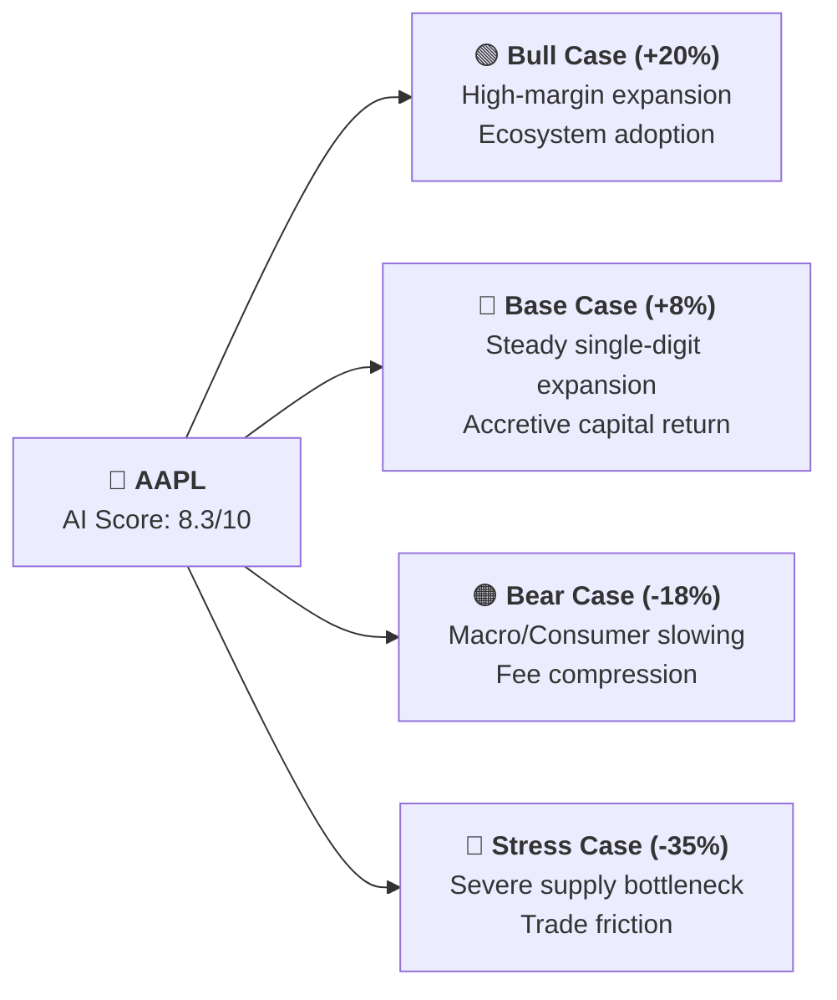
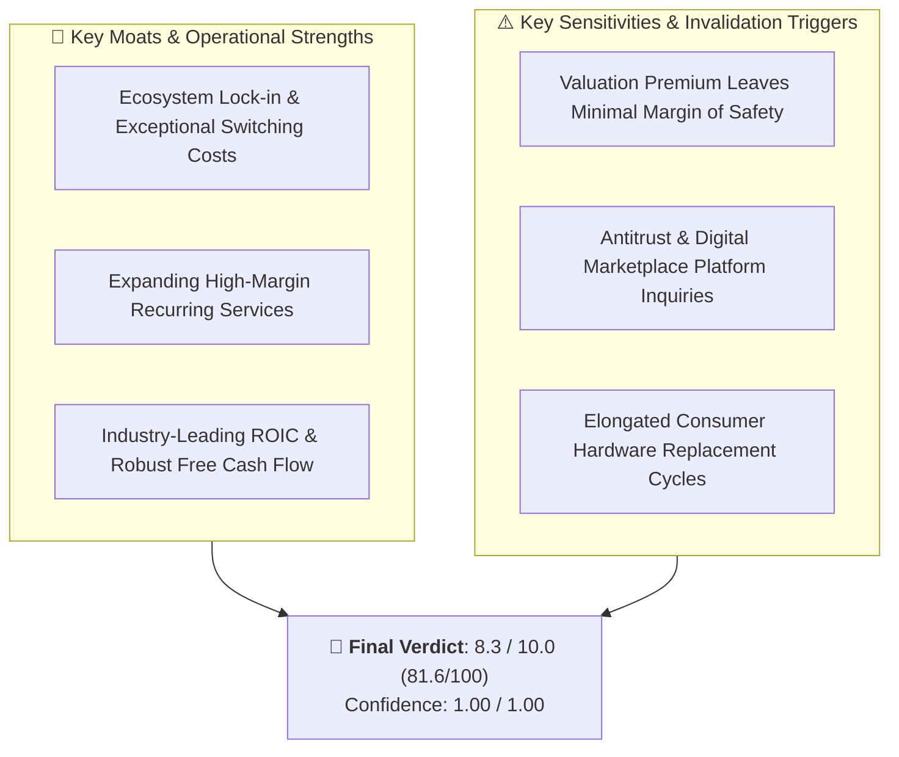

# Apple Inc. (AAPL) — Research Overview & Executive Dashboard

> **Institutional Multi-Agent AI Equity Research System**  
> **Target Horizon**: 6-12 months | **As of**: 2026-09-14 06:37 UTC | **Audit Status**: All 12 Gates Passed (Verified)

---

## ⚡ At-a-Glance Executive Summary

| Key Metric | Status / Value | Quick Interpretation |
| :--- | :---: | :--- |
| **Overall Stance** | 🟢 **BULLISH / HIGH CONVICTION** | Systematic multi-agent recommendation |
| **Composite AI Score** | **`8.3 / 10.0`** | Weighted institutional formula ($0.40F + 0.35T + 0.15S + 0.10M$) |
| **Normalized Score** | **`81.6 / 100`** | Standardized 0–100 percentile rank |
| **Confidence Score** | **`1.00 / 1.00`** | Data completeness score (100% verified) |
| **Quality Gates** | **12 / 12 Passed (0 Vetos)** | Data integrity, SEC/SEDAR filings & freshness verified |

---

## 📊 Visual Multi-Dimensional Scorecard

```
Dimension          Score    Visual Gauge      Rating
-------------------------------------------------------
Fundamental         9.2/10  [█████████░]  🟢 Strong
Technical           8.0/10  [████████░░]  🟢 Bullish
Risk & Solvency     8.5/10  [████████░░]  🟢 Low Risk
Sentiment           7.0/10  [███████░░░]  🟢 Positive
Valuation           6.5/10  [██████░░░░]  🟡 Fair
Growth              4.0/10  [████░░░░░░]  🔴 Slow
Quality             8.0/10  [████████░░]  🟢 Elite
Business Strength   9.0/10  [█████████░]  🟢 Wide Moat
Management          8.0/10  [████████░░]  🟢 Disciplined
Catalyst            7.5/10  [████████░░]  🟢 Active
Event Risk          8.0/10  [████████░░]  🟢 Benign
-------------------------------------------------------
COMPOSITE AI SCORE  8.3/10  [████████░░]  🟢 **BULLISH / HIGH CONVICTION**
```

---

## 🧭 Multi-Scenario Projections



---

## 🏛️ Investment Thesis & Competitive Moats



---

## 📁 Research Artifacts & Subdirectories

Explore the complete verified research workspace for **AAPL**:

| Folder | Contents |
| :--- | :--- |
| [📁 `00_identity/`](./00_identity/) | Canonical Security Master identity, CIK, FIGI, Exchange & Currency |
| [📁 `02_normalized_market_data/`](./02_normalized_market_data/) | 252-day daily OHLCV trading bars (`daily_ohlcv.parquet`) |
| [📁 `04_filings/`](./04_filings/) | Primary SEC EDGAR / SEDAR+ XBRL facts (`sec_facts.json`) |
| [📁 `08_macro/`](./08_macro/) | FRED macroeconomic indicator snapshot (`macro_snapshot.json`) |
| [📁 `10_sentiment/`](./10_sentiment/) | GDELT global news sentiment and tone analysis (`sentiment_snapshot.json`) |
| [📁 `21_scores/`](./21_scores/) | Granular mathematical AI sub-scores and weights (`scores.json`) |
| [📁 `23_final_report/`](./23_final_report/) | 📄 **[Full 18-Chapter Report](./23_final_report/report.md)** & 💡 **[In Plain English Summary](./23_final_report/plain_english.md)** |
| [📁 `24_audit/`](./24_audit/) | 🔍 **[Immutable Audit Trail Log](./24_audit/audit_log.json)** (12 Quality Gate Results) |

---
*Report automatically synthesized by Multi-Agent AI Equity Research System.*
